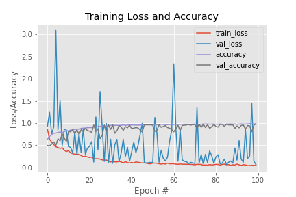

# Drowsiness_Detection
To build a detection system that identifies key attributes of drowsiness and triggers an alert when someone is drowsy before it is too late.  So such a system can be very beneficial to the entire society and for our safety.

Step 1 :– Take image as input from a camera. 
Step 2 :– Find the face within the image and make a region of Interest (ROI). 
Step 3 :– Find the eyes from ROI and feed it to the Model. 
Step 4 :– Model will categorize whether eyes are open or closed. 
Step 5:– Calculate score to check whether the person is drowsy or not. 

